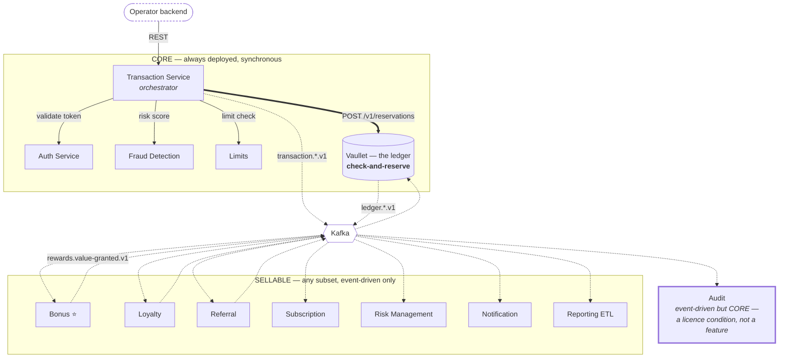
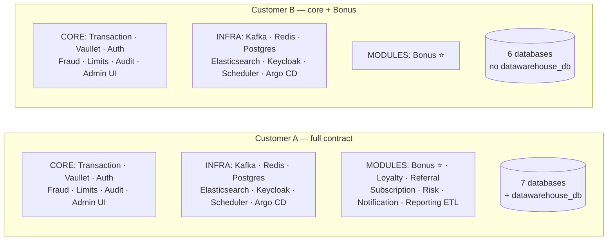

# Vaullet Walleting System - Architecture Overview

## System Architecture

### High-Level Architecture

```
┌─────────────────────────────────────────────────────────────────────────┐
│                            API Gateway                                   │
│                     (Request Routing, Auth, Rate Limiting)              │
└────────────┬────────────────────────────────────────────────────────────┘
             │
             │ REST API
             │
┌────────────┴─────────────────────────────────────────────────────────────┐
│                        Core Services Layer                                │
├───────────────────────────────────────────────────────────────────────────┤
│                                                                           │
│  ┌─────────────────┐  ┌──────────────────┐  ┌────────────────────┐     │
│  │   Transaction   │  │     Vaullet      │  │   Limits Service   │     │
│  │     Service     │  │  (Ledger Service)│  │                    │     │
│  │                 │  │                  │  │                    │     │
│  │  - Lifecycle    │  │  - Append-only   │  │  - Daily limits    │     │
│  │  - Validation   │  │  - Immutable log │  │  - Monthly limits  │     │
│  │  - Status mgmt  │  │  - Balance calc  │  │  - Velocity checks │     │
│  │  - Orchestration│  │  - Source of     │  │  - Spending caps   │     │
│  │  - Heavy lifting│  │    truth         │  │                    │     │
│  └────────┬────────┘  └────────┬─────────┘  └──────────┬─────────┘     │
│           │                    │                        │               │
│  ┌────────┴────────┐  ┌───────┴──────────┐  ┌──────────┴─────────┐    │
│  │  Bonus Service ⭐│  │  Loyalty Service │  │ Subscription Svc   │    │
│  │                 │  │                  │  │                    │    │
│  │  - Cashback     │  │  - Points/tiers  │  │  - Recurring pay   │    │
│  │  - Promotions   │  │  - Redemption    │  │  - Billing cycles  │    │
│  │  - Wagering     │  │  - Thresholds    │  │  - Retry logic     │    │
│  │  SELLABLE       │  │  SELLABLE        │  │  SELLABLE          │    │
│  └─────────────────┘  └──────────────────┘  └────────────────────┘    │
│                                                                         │
└─────────────────────────────────────────────────────────────────────────┘

┌─────────────────────────────────────────────────────────────────────────┐
│                      Security & Risk Layer                               │
├───────────────────────────────────────────────────────────────────────────┤
│                                                                           │
│  ┌──────────────────┐  ┌────────────────────┐  ┌──────────────────┐    │
│  │  Auth Service    │  │ Fraud Detection    │  │ Risk Management  │    │
│  │  + Keycloak      │  │     Service        │  │    Service       │    │
│  │                  │  │                    │  │                  │    │
│  │  - Keycloak: IdP │  │  - Real-time rules │  │  - Case mgmt     │    │
│  │    (users, MFA,  │  │  - ML scoring      │  │  - Investigation │    │
│  │    brokering)    │  │  - Pattern detect  │  │  - Reviews       │    │
│  │  - Adapter:      │  │  - Risk scoring    │  │  - Actions       │    │
│  │    anchor+status │  │                    │  │                  │    │
│  └──────────────────┘  └────────────────────┘  └──────────────────┘    │
│                                                                          │
└──────────────────────────────────────────────────────────────────────────┘

┌──────────────────────────────────────────────────────────────────────────┐
│                      Supporting Services Layer                            │
├───────────────────────────────────────────────────────────────────────────┤
│                                                                           │
│  ┌──────────────────┐  ┌──────────────────┐  ┌──────────────────┐      │
│  │  Notification    │  │  Audit Service   │  │ Scheduler Service│      │
│  │    Service       │  │                  │  │                  │      │
│  │                  │  │  - Compliance    │  │  - Cron jobs     │      │
│  │  - Email/SMS     │  │  - Audit logs    │  │  - Recurring pay │      │
│  │  - Push notif    │  │  - Reporting     │  │  - Retries       │      │
│  │  - Templates     │  │  - Retention     │  │  - Scheduled evt │      │
│  └──────────────────┘  └──────────────────┘  └──────────────────┘      │
│                                                                          │
└──────────────────────────────────────────────────────────────────────────┘

┌──────────────────────────────────────────────────────────────────────────┐
│                      Infrastructure Layer                                 │
├───────────────────────────────────────────────────────────────────────────┤
│                                                                           │
│  ┌──────────────────────────────────────────────────────────────────┐   │
│  │                    Apache Kafka (Event Bus)                       │   │
│  │  Topics: <domain>.<event-name>.v<major>   (ADR-007)              │   │
│  │  e.g. transaction.created.v1, rewards.value-granted.v1           │   │
│  │  Keyed by account_id · JSON Schema · FULL_TRANSITIVE registry    │   │
│  └──────────────────────────────────────────────────────────────────┘   │
│                                                                           │
│  ┌──────────────────┐  ┌──────────────────┐  ┌──────────────────┐      │
│  │   PostgreSQL     │  │     Redis        │  │   Monitoring     │      │
│  │   (Hybrid)       │  │  (Cache, Locks)  │  │  (Prometheus,    │      │
│  │   See below ↓    │  │                  │  │   Grafana)       │      │
│  └──────────────────┘  └──────────────────┘  └──────────────────┘      │
│                                                                          │
└──────────────────────────────────────────────────────────────────────────┘
```

### Database Architecture (Hybrid Strategy)

```
┌─────────────────────────────────────────────────────────────────────┐
│                    Isolated Databases (Critical)                    │
└─────────────────────────────────────────────────────────────────────┘

┌─────────────────┐         ┌─────────────────┐         ┌─────────────────┐
│ Vaullet Service │────────→│   vaullet_db    │         │ Transaction Svc │
│                 │         │   PostgreSQL    │         │                 │
│ - Append-only   │         │                 │         │ - Mutable state │
│ - Immutable     │         │ - ledger_entries│         │ - High volume   │
│ - Source of     │         │ - balances      │         │ - Lifecycle     │
│   truth         │         │ - audit_log     │         │                 │
└─────────────────┘         └─────────────────┘         └─────────────────┘
                                                                 │
                                                                 ↓
                                                         ┌─────────────────┐
                                                         │ transactions_db │
                                                         │   PostgreSQL    │
                                                         │                 │
                                                         │ - transactions  │
                                                         │ - refunds       │
┌─────────────────┐                                     │ - metadata      │
│ Fraud Detection │                                     └─────────────────┘
│     Service     │
│                 │
│ - Real-time ML  │
│ - Pattern detect│         ┌─────────────────┐
│ - Case mgmt     │────────→│    fraud_db     │
│                 │         │ PostgreSQL +    │
└─────────────────┘         │ Elasticsearch   │
                            │                 │
                            │ - fraud_cases   │
                            │ - fraud_rules   │
                            │ - patterns (ES) │
                            └─────────────────┘

┌─────────────────────────────────────────────────────────────────────┐
│                 Auth Database (Isolated) 🔐                         │
└─────────────────────────────────────────────────────────────────────┘

┌─────────────────┐         ┌─────────────────────────────────────┐
│  Auth Service   │────────→│         auth_db (PostgreSQL)        │
│                 │         │  users, credentials, mfa_configs,   │
│  - Core module  │         │  roles, permissions, api_clients    │
└─────────────────┘         └─────────────────────────────────────┘

┌─────────────────────────────────────────────────────────────────────┐
│        Rewards Database (Shared) — CONDITIONAL on contract          │
└─────────────────────────────────────────────────────────────────────┘

┌─────────────────┐         ┌─────────────────────────────────────┐
│ Bonus Service ⭐│────────→│        rewards_db (PostgreSQL)      │
└─────────────────┘         │                                     │
                            │  bonus_schema     (if sold)         │
┌─────────────────┐         │  loyalty_schema   (if sold)         │
│ Loyalty Service │────────→│  referral_schema  (if sold)         │
└─────────────────┘         │                                     │
                            │  Holds RULES only — wagering terms, │
┌─────────────────┐         │  tiers, campaigns. Never balances.  │
│ Referral Service│────────→│  Promotional MONEY lives in         │
└─────────────────┘         │  vaullet_db buckets (ADR-004).      │
                            └─────────────────────────────────────┘

┌─────────────────────────────────────────────────────────────────────┐
│              Support Database (Shared) — mixed                       │
└─────────────────────────────────────────────────────────────────────┘

┌─────────────────┐         ┌─────────────────────────────────────┐
│ Limits Service  │────────→│         support_db (PostgreSQL)     │
│    (core)       │         │                                     │
└─────────────────┘         │  limits_schema      (always)        │
                            │  audit_schema       (always)        │
┌─────────────────┐         │  scheduler_schema   (always)        │
│  Audit Service  │────────→│                                     │
│    (core)       │         │  subscription_schema  (if sold)     │
└─────────────────┘         │  notification_schema  (if sold)     │
                            │                                     │
┌─────────────────┐         │  Schema-per-service isolation with  │
│ Scheduler (infra)│───────→│  dedicated credentials per service. │
└─────────────────┘         └─────────────────────────────────────┘
                                         ↑
┌─────────────────┐  ┌──────────────────┐│
│ Subscription Svc│──│ Notification Svc │┘
│   (sellable)    │  │   (sellable)     │
└─────────────────┘  └──────────────────┘

┌─────────────────────────────────────────────────────────────────────┐
│                   Analytics / Reporting Layer                       │
└─────────────────────────────────────────────────────────────────────┘

                    ┌────────────────────────────────┐
                    │      Apache Kafka Topics       │
                    │  transaction.*, bonus.*,       │
                    │  refund.*, fraud.*, etc.       │
                    └────────────────────────────────┘
                                   │
                                   ↓ (ETL consumes events)
                    ┌────────────────────────────────┐
                    │   Reporting ETL Service        │
                    │   (SELLABLE — may be absent)   │
                    │   - Joins data from events     │
                    │   - Denormalizes               │
                    │   - Pre-aggregates metrics     │
                    └────────────────────────────────┘
                                   │
                                   ↓
                    ┌────────────────────────────────┐
                    │      datawarehouse_db          │
                    │   PostgreSQL (Phase 1)         │
                    │   → ClickHouse (Phase 2)       │
                    │   Provisioned only if sold     │
                    │                                │
                    │ - transaction_analytics        │
                    │ - daily_metrics                │
                    │ - user_summaries               │
                    │ - rewards_analytics            │
                    │ - merchant_analytics           │
                    └────────────────────────────────┘
                                   ↑
                                   │ (Read-only queries)
                    ┌────────────────────────────────┐
                    │    BI Tools / Dashboards       │
                    │   Metabase, Tableau, etc.      │
                    └────────────────────────────────┘

┌─────────────────────────────────────────────────────────────────────┐
│                         Cache Layer                                 │
└─────────────────────────────────────────────────────────────────────┘

                    ┌────────────────────────────────┐
                    │      Redis Cluster             │
                    │   (3 masters, 3 replicas)      │
                    │                                │
                    │ Namespaces:                    │
                    │ - session:* (Auth)             │
                    │ - balance:cache:* (Vaullet)    │
                    │ - limits:counter:* (Limits)    │
                    │ - fraud:cache:* (Fraud)        │
                    └────────────────────────────────┘

  Note: Redis holds no locks. Balance consistency is enforced inside a
  Postgres transaction in Vaullet (ADR-004). Redis is a cache, not a
  correctness dependency.
```

**Database Summary**:
- **7 PostgreSQL databases** + Redis Cluster + Elasticsearch = **9 infrastructure components** (full deployment)
- **Isolated**: `vaullet_db` (ledger), `transactions_db` (high volume), `fraud_db` (special tech), `auth_db` (security)
- **Shared, schema-per-service**: `rewards_db` (Bonus, Loyalty, Referral), `support_db` (Limits, Subscription, Notification, Audit, Scheduler)
- **Analytics**: `datawarehouse_db`, populated from Kafka events (CQRS pattern)
- **Conditional**: `rewards_db` and `datawarehouse_db` are provisioned only when the customer's
  contract includes a module that needs them. A core-only deployment runs 5 PostgreSQL databases.
- See [ADR-003](docs/adr/003-hybrid-database-strategy-with-analytics.md) and
  [ADR-005](docs/adr/005-module-composition-and-deployment-topology.md) for details

## Service Details

### Core Services

#### 1. **Vaullet (Ledger Service)** ⭐ — CORE
**Role**: Source of truth for all money movements, and the authority on available balance

**Characteristics**:
- **Append-only journal**: `ledger_entries` is never updated or deleted
- **Derived projection**: `account_balances` and `balance_buckets` are mutable but rebuildable by
  replaying the journal. This is the standard journal-plus-balances split; "append-only" describes
  the journal, not the whole service.
- **Synchronous on the write path**: exposes `POST /reservations`, which atomically checks and holds
  balance in one Postgres transaction (ADR-004). This is what makes overdrafts impossible.
- **Typed money**: balances are held in per-grant buckets (`CASH`, `BONUS`, `LOYALTY`, `REFERRAL`)
  with their own `withdrawable` flag, expiry and spend priority.
- **Single currency**: one deployment, one operator-supplied currency, recorded immutably in
  `ledger_config` and asserted at every API boundary (ADR-004). Not a per-row column.

**Responsibilities**:
- Atomically reserve, settle, release and expire holds
- Record all money movement as an immutable, append-only journal. **Single-sided**: entries are written
  against user accounts only — there is no counterparty row and no house account in `vaullet_db`. The
  operator's own position is reconstructed downstream in `datawarehouse_db` (ADR-004, *Scope*)
- Maintain per-bucket balances and compute withdrawable balance
- Provide transaction history

**Database**: `vaullet_db` — PostgreSQL

**REST API (Synchronous)**:
- `POST /v1/reservations` → atomic check-and-hold, with a caller-supplied `expires_in_seconds`
  (default 300, bounded by `max_hold_seconds`) ⭐
- `GET /v1/reservations/{id}` → state, allocations, `expires_at`
- `DELETE /v1/reservations/{id}` → release
- `GET /v1/accounts/{id}/balance` → `{posted, held, available, withdrawable}`

**Event Consumption**:
- `transaction.completed` → settle reservation, write journal entries
- `transaction.failed` → release reservation
- `rewards.value-granted` (from Bonus / Loyalty / Referral) → mint a new balance bucket
- `bonus.revoked` → debit the granting bucket

**Event Production**:
- `ledger.entry-recorded`
- `ledger.balance-updated`
- `ledger.settlement-rejected` (hold expired before settlement)
- `ledger.hold-expired` (a reservation released without capture — a business event for long two-phase
  holds, surfaced to the operator as `transaction.expired`)

> **Event names in this document are logical names.** The Kafka topic appends the major version, per
> ADR-007's `<domain>.<event-name>.v<major>` — `transaction.completed` here is the topic
> `transaction.completed.v1`.

---

#### 2. **Transaction Service** 🔧 — CORE
**Role**: Heavy lifting - transaction lifecycle management

**Characteristics**:
- **Mutable**: Transaction status changes over time
- **Orchestrator**: Coordinates validation checks
- **Complex logic**: Handles business rules, state machines

**Responsibilities**:
- Create and manage transaction lifecycle
- Coordinate with Fraud, Limits, Vaullet services
- Handle transaction status transitions (PENDING → APPROVED → COMPLETED)
- Store user-facing transaction metadata
- Link transactions with refunds, bonuses

**Database**: PostgreSQL (mutable schema)

**REST API (Synchronous)**:
- GET /transactions/{id}
- POST /transactions
- GET /transactions/user/{userId}

**Event Production**:
- `transaction.created`
- `transaction.approved`
- `transaction.completed`
- `transaction.failed`

**Event Consumption**:
- `refund.initiated` → Link refund to transaction
- `bonus.applied` → Update transaction with bonus
- `fraud.suspicion-detected` → Update transaction status

---

#### 3. **Limits Service** — CORE
**Role**: Enforce spending limits and velocity checks

**Responsibilities**:
- Daily/monthly spending limits per user
- Transaction velocity checks (e.g., max 5 per hour)
- Merchant category limits
- Dynamic limit adjustments based on risk

**Database**: Redis (counters) + PostgreSQL (configuration)

**REST API (Synchronous)**:
- POST /limits/check → Called by Transaction Service
- GET /limits/user/{userId}
- PUT /limits/user/{userId}

**Event Consumption**:
- `transaction.created` → Increment usage counters
- `refund.initiated` → Decrement usage counters
- `limits.threshold-reached` → Alert user

---

#### 4. **Bonus Service** ⭐ — SELLABLE (flagship)
**Role**: Manage cashback, promotions, loyalty rewards

**Responsibilities**:
- Calculate bonus eligibility
- Apply bonuses to transactions
- Revoke bonuses on refunds
- Track bonus expiration
- Loyalty program management

**Database**: PostgreSQL

**The flagship module.** Bonus does not hold balances — it holds *rules* (wagering terms, campaign
eligibility, expiry policy) in `rewards_db`, and grants money into `vaullet_db` balance buckets by
emitting events. That split is what keeps it removable: a deployment without Bonus has a ledger with
one `CASH` bucket per account and no promotional logic anywhere.

**Event Production**:
- `rewards.value-granted` — mints a `BONUS` bucket in the ledger (shared contract with Loyalty and Referral)
- `bonus.applied`
- `bonus.revoked`
- `bonus.expired`
- `bonus.wagering-completed` → ledger transfers `BONUS` → `CASH`, making funds withdrawable

**Event Consumption**:
- `transaction.created` → Check eligibility
- `refund.initiated` → Revoke bonus if applicable
- `transaction.completed` → Loyalty rewards

---

#### 5. **Refund** (part of Transaction Service) — CORE
**Role**: Handle full and partial refunds

**Not a separate deployment.** Refund logic ships inside Transaction Service and shares
`transactions_db`. It was previously specified as its own service; splitting it would have put two
services on the same database with no independent scaling or release benefit.

**Responsibilities**:
- Validate refund requests and check refund policies
- Process refund lifecycle
- Trigger bonus reversal (by event; Bonus may not be deployed)

**Database**: `transactions_db` (shared with Transaction Service)

**Event Production**:
- `refund.initiated`
- `refund.completed`
- `refund.failed`

**Refund and buckets**: a refund returns money to the bucket it was drawn from, using the
`reservation_allocations` recorded at reserve time (ADR-004). Cash refunds to cash; bonus refunds to
bonus. Without that record there would be no correct way to reverse a mixed-bucket payment.

---

#### 6. **Subscription Service** — SELLABLE
**Role**: Manage recurring payments

**Responsibilities**:
- Create and manage subscriptions
- Handle billing cycles
- Retry failed payments
- Suspend/cancel subscriptions

**Database**: PostgreSQL

**Event Production**:
- `subscription.created`
- `subscription.suspended`
- `subscription.cancelled`

**Event Consumption**:
- `scheduler.payment-due` → request a transaction from Transaction Service
- `transaction.completed` → advance the billing cycle
- `transaction.failed` → retry or suspend per policy

Subscription produces no money-movement events. It requests transactions and reacts to the outcome;
`transaction.completed` is the single event for money having moved (ADR-007).

---

#### 6a. **Loyalty Service** — SELLABLE
**Role**: Points, tiers, and redemption

Sells independently of Bonus. Awards points on qualifying events, manages tier thresholds, and
converts redemptions into ledger value via `rewards.value-granted` (bucket type `LOYALTY`).

**Database**: `rewards_db` (`loyalty_schema`)

**Event Consumption**: `transaction.completed`, `rewards.value-granted`
**Event Production**: `rewards.value-granted`, `loyalty.tier-changed`, `loyalty.points-redeemed`

---

#### 6b. **Referral Service** — SELLABLE
**Role**: User referral programme

Sells independently of Bonus. Tracks referral links and attribution, and pays referral rewards as
ledger value via `rewards.value-granted` (bucket type `REFERRAL`).

**Database**: `rewards_db` (`referral_schema`)

**Event Consumption**: `auth.user-registered`, `transaction.completed`
**Event Production**: `rewards.value-granted`, `referral.completed`

---

#### 6c. **Reporting ETL Service** — SELLABLE
**Role**: Populate the analytics store from the event stream

Consumes every domain event, denormalizes and pre-aggregates into `datawarehouse_db` (CQRS). Never
queries an operational database — that is the whole point of the separation (ADR-003).

**Database**: `datawarehouse_db` (provisioned only when this module is sold)

**Event Consumption**: all topics
**Event Production**: none

---

### Security & Risk Services

#### 7. **Auth Service** — CORE (thin adapter over Keycloak)
**Role**: Authentication and authorization

**Responsibilities**:
- User login/logout
- JWT token generation and validation
- Multi-factor authentication (MFA)
- Session management
- Permission checks

**Database**: PostgreSQL + Redis (sessions)

---

#### 8. **Fraud Detection Service** — CORE
**Role**: Real-time fraud prevention

**Responsibilities**:
- Rule-based fraud checks (velocity, location, amount)
- ML model scoring
- Risk assessment
- Pattern detection

**Database**: PostgreSQL (rules, cases) + Redis (real-time data)

**REST API (Synchronous)**:
- POST /fraud/analyze-transaction → Called by Transaction Service before transaction creation

**Event Production**:
- `fraud.analysis-completed`
- `fraud.suspicion-detected`
- `fraud.pattern-detected`

---

#### 9. **Risk Management Service** — SELLABLE
**Role**: Fraud case management and investigation

**Responsibilities**:
- Create fraud cases
- Manual review workflow
- Investigator assignment
- Case resolution
- Account actions (freeze, unfreeze)

**Database**: PostgreSQL

**Event Production**:
- `risk.case-created`
- `risk.case-reviewed`
- `risk.account-locked`
- `risk.account-unlocked`

---

### Supporting Services

#### 10. **Notification Service** — SELLABLE
**Role**: Multi-channel notifications

**Responsibilities**:
- Email notifications
- SMS notifications
- Push notifications
- Template management
- Delivery tracking

**Database**: PostgreSQL (templates, delivery logs)

**Event Consumption**: Listens to ALL events that require user notification

---

#### 11. **Audit Service** — CORE (compliance)
**Role**: Compliance and audit logging

**Responsibilities**:
- Log all financial events
- Compliance reporting
- Audit trail maintenance
- Data retention policies

**Database**: PostgreSQL (time-series optimized)

**Event Consumption**: Listens to ALL events for audit logging

---

#### 12. **Scheduler Service** — PLATFORM INFRASTRUCTURE
**Role**: Job scheduling and execution

**Responsibilities**:
- Cron-based job execution
- Recurring payment triggers
- Retry scheduling
- One-time scheduled events

**Database**: PostgreSQL (job definitions)

**Event Production**:
- `scheduler.payment-due`
- `scheduled-job.executed`

---

## Communication Patterns

### The dependency rule, drawn



**Every solid line is synchronous, and every solid line ends in a core component.** That is the whole
of ADR-005's rule, drawn: *a synchronous dependency makes a component core; optional functionality
communicates only through events.* Nothing in the SELLABLE box is reachable by a solid line, which is
why any of its 2⁷ = 128 subsets is a valid deployment — a consumer group that is not deployed costs
nothing, and no caller ever gets a connection error for a module the customer did not buy.

The double line is the one that decides money: `POST /v1/reservations` is where the balance invariant
is enforced, atomically, before the transaction is allowed to proceed (ADR-004).

Audit is drawn outside both boxes on purpose. It is event-driven, so the rule says it could be
optional — but a deployment without an audit trail is not licensable, so it is core for regulatory
reasons rather than architectural ones. It is the single deliberate exception, recorded here so it is
not rediscovered during a certification review.

### Synchronous (REST) - Pre-transaction Validation
```
User Request
    ↓
API Gateway
    ↓
Transaction Service ──→ Auth Service (validate token)
    ↓
    ├──→ Fraud Detection Service (analyze risk)
    ├──→ Limits Service (check limits)
    └──→ Vaullet POST /reservations  ← atomic check-and-HOLD, not a read
    ↓
Decision: APPROVE / REJECT / REVIEW
```

**Every service on this path is core** (ADR-005). That is not a coincidence — it is the rule:
a synchronous dependency cannot be optional, because a missing one fails either closed (halting all
transactions) or open (silently disabling a financial control).

The reservation step is where the overdraft invariant is decided. It is a *write*, committed inside
one Postgres transaction in Vaullet, not a balance read followed by a hopeful approval — see
[ADR-004](docs/adr/004-atomic-balance-reservations.md) for why the earlier lock-and-read design
did not work.

### Asynchronous (Kafka Events) - Post-transaction Processing
```
Transaction Service publishes: transaction.created
    ↓
    ├──→ Vaullet: Create ledger entry
    ├──→ Limits Service: Update counters
    ├──→ Bonus Service: Check eligibility
    ├──→ Audit Service: Log event
    └──→ Notification Service: Send confirmation
```

## Key Architectural Principles

### 1. **Vaullet (Ledger) is Special**
- **Immutable journal** - `ledger_entries` is only ever appended to
- **Single source of truth** for balances, including promotional money
- **Isolated database** - no other service writes to `vaullet_db`
- **Strong consistency on the write path** - reservations are ACID, not eventual. Everything
  *downstream* of a settled entry is eventually consistent; the balance decision itself is not.

### 2. **Transaction Service Orchestrates**
- Makes synchronous calls for validation
- Publishes events for side effects
- Handles complex business logic
- Manages state transitions

### 3. **Event-Driven Choreography**
- Services react to events independently
- No central orchestrator (except Transaction Service for its domain)
- Loose coupling via Kafka
- Each service is autonomous

### 4. **Polyrepo Structure**
Each service is a separate Git repository. Category per
[ADR-005](docs/adr/005-module-composition-and-deployment-topology.md):

**Core** (always deployed, never optional):
- `wallet-transaction-service` (includes Refund)
- `wallet-vaullet-service` ⭐
- `wallet-auth-service`
- `wallet-fraud-detection-service`
- `wallet-limits-service`
- `wallet-audit-service` (core by compliance, not by architecture)
- `wallet-admin-ui`

**Platform infrastructure** (always deployed, never sold):
- `wallet-scheduler-service`

**Sellable modules** (deployed only if the contract includes them):
- `wallet-bonus-service` ⭐ *flagship*
- `wallet-loyalty-service`
- `wallet-referral-service`
- `wallet-subscription-service`
- `wallet-risk-management-service`
- `wallet-notification-service`
- `wallet-reporting-etl-service`

**Shared**:
- `wallet-shared-contracts` (DTOs, event schemas — defines all events regardless of what's deployed)
- `wallet-infrastructure` (Terraform, Helm umbrella chart, K8s manifests)
- `wallet-contracts` (per-customer Helm values, GitOps)

**Total**: 14 backend services + Admin UI.

(6 core backend + 1 platform infrastructure + 7 sellable modules. The earlier figure of 15 counted
Refund as a separate service, before it was folded into Transaction Service.)

## Data Flow Examples

### Example 1: User Makes a Withdrawal

```
1. User → API Gateway → Transaction Service
2. Transaction Service → Auth Service (REST): Validate token ✓
3. Transaction Service → Fraud Detection (REST): Analyze (risk: LOW) ✓
4. Transaction Service → Limits Service (REST): Check limit ✓
5. Transaction Service → Vaullet (REST): POST /reservations
      → Vaullet, in ONE Postgres transaction:
          lock account row → allocate across buckets by spend_priority
          → insert reservation + allocations → increment held_total
      → 201 {reservation_id}   (or 409 INSUFFICIENT_FUNDS)
6. Transaction Service: Create transaction (status: APPROVED)
7. Transaction Service → Kafka: Publish transaction.created

   Event: transaction.created
   ↓
   ├─→ Limits Service: Increment daily usage
   ├─→ Bonus Service (if deployed): Check cashback eligibility → Publish rewards.value-granted
   ├─→ Audit Service: Log transaction
   └─→ Notification Service (if deployed): Send confirmation email

8. On completion → Transaction Service publishes transaction.completed
   ↓
   └─→ Vaullet: SETTLE — write journal entries, release hold, apply to posted_balance

   On failure → transaction.failed → Vaullet RELEASES the hold. No journal entry:
   money that never moved leaves no record.
```

**Note the money is held at step 5, not step 8.** Between approval and settlement the funds are
unavailable to any other transaction, which is what makes concurrent withdrawals safe. Consumers
that aren't deployed simply don't appear — the producer is unaffected.

### Example 2: Fraud Detected

```
1. Transaction Service → Fraud Detection (REST): Analyze
2. Fraud Detection: Risk = HIGH, Decision = BLOCK
3. Transaction Service: Create transaction (status: BLOCKED_FRAUD)
4. Fraud Detection → Kafka: Publish fraud.suspicion-detected

   Event: fraud.suspicion-detected
   ↓
   ├─→ Risk Management: Create fraud case
   ├─→ Auth Service: Require MFA on next login
   ├─→ Notification Service: Alert user via SMS
   └─→ Notification Service: Alert fraud team via Slack
```

### Example 3: Recurring Payment

```
1. Scheduler Service (cron trigger) → Kafka: Publish scheduler.payment-due
2. Subscription Service consumes event
3. Subscription Service → Transaction Service (REST): POST /transactions
      Subscription does NOT check limits or balance itself. It requests a transaction
      like any other client, and Transaction Service runs the standard approval path
      (auth → fraud → limits → reserve).
4. Transaction Service: normal flow — approve, settle, publish transaction.completed
5. Subscription Service consumes transaction.completed → advance billing cycle
      (or transaction.failed → retry / suspend per policy)

   Event: transaction.completed
   ↓
   ├─→ Vaullet: Settle the hold, write journal entries
   ├─→ Limits Service: Update monthly usage
   ├─→ Bonus Service (if deployed): Apply loyalty cashback → rewards.value-granted
   ├─→ Audit Service: Log transaction
   └─→ Notification Service (if deployed): Send payment confirmation
```

**Why Subscription doesn't call Limits and Vaullet directly**: it previously did, which put the
money path in two places — one in Transaction Service, one in Subscription. Every future control
(a new fraud rule, a regulatory check) would need implementing twice, and the second copy would
drift. It also broke the ADR-005 rule: a sellable module held synchronous clients for core services
and duplicated core logic. There is exactly one path money can move by, and every caller uses it.

## Technology Stack

- **Language**: Java 17+
- **Framework**: Spring Boot 3.x
- **Event Bus**: Apache Kafka
- **Databases**: PostgreSQL (hybrid grouping — see ADR-003) + Elasticsearch (fraud patterns)
- **Cache**: Redis
- **API Gateway**: Spring Cloud Gateway / Kong
- **Service Discovery**: Kubernetes native / Consul
- **Monitoring**: Prometheus + Grafana
- **Logging**: ELK Stack (Elasticsearch, Logstash, Kibana)
- **Tracing**: Jaeger / Zipkin
- **Container**: Docker
- **Orchestration**: Kubernetes

## Market Context and Comparable Systems

Vaullet is a **closed-loop stored-value wallet**: money enters by top-up, lives as a balance on an
internal ledger, is spent inside one operator's ecosystem, and may be withdrawn. That is a different
product from a payment gateway (moves money between parties, holds none) or an open-loop card
programme (spends anywhere on a card network).

Within iGaming this layer has a name — **PAM** (Player Account Management): the backend owning
accounts, wallet, bonuses, KYC hooks, responsible-gambling controls and regulator-facing reporting.
Vaullet is the wallet, ledger and bonus core of a PAM, without the game aggregation or sportsbook.

### Comparable systems

**Tier 1 — iGaming platform / PAM providers** (the direct market):

| Product | Shape | Relation to Vaullet |
|---|---|---|
| **Playtech IMS** | Tier-1 licensed platform; operators license specific layers (IMS, Pulse CRM, aggregator, sportsbook) | Closest commercial analogue — modular licensing per contract is exactly ADR-005 |
| **EveryMatrix** | Modular platform, operator keeps control of composition | Same modular thesis, broader scope (content aggregation) |
| **SOFTSWISS** | White-label casino platform, strong crypto support | Turnkey rather than composable; wider scope |
| **Pragmatic Solutions**, **BetConstruct**, **Digitain**, **Bede** | PAM / platform vendors | Same category, varying turnkey-vs-modular balance |

**Tier 2 — Ledger-as-a-Service / wallet infrastructure** (the technical analogue):

| Product | Shape | Relation to Vaullet |
|---|---|---|
| **Formance** | Open-source programmable double-entry ledger; explicit *programmable wallets* product with **holds** | The closest technical analogue to ADR-004 — same reservation/hold model, arrived at independently |
| **TigerBeetle** | Purpose-built financial accounting database, native debit/credit schema, very high throughput | What ADR-004's Alternative 3 becomes at scale; a candidate to sit *under* Vaullet rather than beside it |
| **Fragment**, **Twisp** | Ledger APIs | Ledger primitives without domain logic |
| **Modern Treasury** | Payment operations + ledger | Broader ops scope, US bank-rail oriented |

**Tier 3 — closed-loop wallets in other verticals** (adjacent markets, largely the same machinery):

| Domain | Example | Fit |
|---|---|---|
| Game economies | **Xsolla**, **Tilia** | Strongest adjacent fit — "purchased currency" vs "earned, non-cashable currency" *is* the ADR-004 bucket model with `withdrawable` |
| Retail loyalty | **Starbucks** app | Canonical closed-loop stored value: preload, earn, redeem |
| Super-apps / delivery | Ride and delivery wallets | Top-up + credits + referral; the Referral and Loyalty modules map directly |
| Marketplace payouts | Seller balances | Holds and rolling reserves map onto the reservation model |

> **On named operator relationships**: the vendor landscape above is publicly documented; *which
> operator brand runs on which platform* generally is not, changes with contract cycles, and is often
> commercially confidential. Verify before citing any specific pairing externally.

### Where Vaullet sits

At the intersection of Tier 1 and Tier 2: **the ledger correctness of a Formance or TigerBeetle, with
the bonus mechanics of an iGaming PAM, deployed single-tenant per operator.**

Two design choices that looked like invention turn out to be established practice, which is
reassuring rather than disappointing:

- **Modular licensing per contract** (ADR-005) is how Playtech sells IMS today — operators license
  the layers they want rather than a monolith.
- **Holds against a journal-plus-projection ledger** (ADR-004) is exactly what Formance's programmable
  wallets do. Arriving there independently, after finding the flaw in ADR-001, is a good sign the
  reasoning was sound rather than novel. Formance is fully double-entry; Vaullet's journal is
  single-sided, which is the deliberate scope difference between a wallet and a general ledger.

### Deliberately out of scope

Vaullet is not, and does not attempt to be: an open-loop card issuer (scheme integration,
settlement, chargebacks), a payment gateway or PSP (it consumes rails, it does not provide them), a
KYC/AML vendor (the operator holds identity — ADR-006), an FX or remittance engine (one currency per
deployment — ADR-004), or a game aggregator or sportsbook.

### Deferred: safeguarding and float reconciliation

Stored value means real money sits in a bank account outside the system, and regulated operators are
required to keep it segregated and reconciled against the customer ledger. Vaullet does not address
this yet — deliberately deferred as a licensing concern rather than a design-phase one.

## Deployment Topology

Vaullet is sold as a **single-tenant deployment**: each customer runs their own Kubernetes cluster
with their own instance of the platform. There is no shared infrastructure between customers, no
`tenant_id`, and no cross-customer data path. Isolation is the cluster boundary — stronger than
row-level scoping, and frequently mandatory under gambling licences with data-residency conditions.

A contract determines which modules that customer's cluster runs. Modules a customer did not buy are
**not deployed at all** — no pod, no schema, no consumer group.

The same per-customer values file also carries **currency** (operator-supplied, one per deployment,
immutable after provisioning) and the **Auth adapter** (local identity vs. federated OIDC).



Customer B is not Customer A with features switched off. The pods, the schemas, the Kafka topics and
the consumer groups for everything they did not buy **do not exist** — enablement is build-time, per
customer Helm values, not a runtime flag. "Not installed" is demonstrable to a regulator; "flag is
false" requires trusting runtime state.

```
Customer A (full)                    Customer B (core + Bonus only)
┌──────────────────────────┐         ┌──────────────────────────┐
│ CORE                     │         │ CORE                     │
│  Transaction, Vaullet,   │         │  Transaction, Vaullet,   │
│  Auth, Fraud, Limits,    │         │  Auth, Fraud, Limits,    │
│  Audit, Admin UI         │         │  Audit, Admin UI         │
│ INFRA                    │         │ INFRA                    │
│  Scheduler, Kafka, Redis │         │  Scheduler, Kafka, Redis │
│ MODULES                  │         │ MODULES                  │
│  Bonus ⭐ Loyalty        │         │  Bonus ⭐                │
│  Referral Subscription   │         │                          │
│  RiskMgmt Notification   │         │                          │
│  ReportingETL            │         │                          │
│ DATABASES: 7             │         │ DATABASES: 6             │
│  + datawarehouse_db      │         │  (no datawarehouse_db)   │
└──────────────────────────┘         └──────────────────────────┘
```

**The rule that makes this work**: *a synchronous dependency makes a component core; optional
functionality communicates only through events.* Turning off an event consumer is safe — Kafka
neither knows nor cares that a consumer group is absent. Turning off a synchronous dependency is
not. So nothing optional sits in a synchronous path.

**The invariant**: *no sellable module may depend on another sellable module.* Every module
dependency points at core or infrastructure, so the module graph is a star, not a mesh — and all
2⁷ = 128 combinations of sellable modules are valid by construction. There are no illegal
configurations to detect or guard against.

See [ADR-005](docs/adr/005-module-composition-and-deployment-topology.md) for the full treatment.

## Architectural Decisions

Key architectural decisions are documented as **Architecture Decision Records (ADRs)** in the `docs/adr/` directory.

### Active ADRs

- [ADR-001: Use Redis Distributed Locking for Balance Consistency](docs/adr/001-distributed-locking-for-balance-consistency.md) ⛔ **Superseded by ADR-004**
  - The lock guarded a balance *read* while the *write* happened asynchronously after release, so it
    did not prevent the overdraft it was written to prevent. Never implemented.

- [ADR-002: Shared Contracts with Dual Publishing (Java + TypeScript)](docs/adr/002-shared-contracts-versioning-strategy.md) ✅ *(revised 2026-09-02)*
  - **Decision**: One `wallet-shared-contracts` repo publishing **per-domain** artifact pairs —
    `contracts-common`, `-ledger`, `-transaction`, `-payments`, `-rewards`, `-identity` — as Maven
    artifacts and NPM packages. A service depends on the domains it speaks, so a rewards change does
    not version the whole fleet
  - **Two sources of truth**: REST DTOs are authored in Java (TypeScript generated); **event schemas
    are authored as JSON Schema** and Java + TypeScript are generated from them, because ADR-007 makes
    the registered schema the wire contract and events outlive every binding
  - **Frontend-friendly**: DTO suffix stripped (TransactionDTO → Transaction in TypeScript)
  - **Benefits**: blast radius matches the change; wire compatibility is reviewed, not emergent

- [ADR-003: Hybrid Database Strategy with Separate Analytics Database](docs/adr/003-hybrid-database-strategy-with-analytics.md) ✅
  - **Decision**: Use hybrid approach with 3 isolated databases (Vaullet, Transactions, Fraud) + 1 shared database (Support services) + dedicated Reporting database
  - **Isolated**: Vaullet (append-only ledger), Transactions (high volume), Fraud Detection (different tech needs)
  - **Shared**: Limits, Bonus, Subscription, Notification, Audit services share `support_db` with schema-per-service isolation
  - **Reporting**: Separate analytics database populated via Kafka events (CQRS pattern), decouples reporting from operational performance
  - **Benefits**: Critical data isolated, cost-effective, operationally balanced, room to evolve

- [ADR-004: Atomic Balance Reservations in the Ledger](docs/adr/004-atomic-balance-reservations.md) ✅ *(revised 2026-09-02)*
  - **Decision**: Check-and-reserve is a single atomic Postgres transaction inside Vaullet; no distributed locks
  - **Buckets**: money is typed per grant (`CASH`, `BONUS`, `LOYALTY`, `REFERRAL`, `DEBT`) with its own
    withdrawability, expiry and spend priority — so the ledger can express bonus money correctly.
    `DEBT` is an obligation, never a funding source: excluded from allocation and carried in
    `account_balances.debt_total` rather than `posted_balance`
  - **Hold lifetime is the caller's**: `expires_in_seconds`, default 300, bounded by `max_hold_seconds`
    — a wager settling in three days and a purchase settling in 300ms are the same primitive
  - **Single-sided journal**: entries are written against user accounts only. No house account, and
    deliberately so — a counterparty row would serialize every transaction in the deployment
  - **Backstop**: `CHECK (posted_balance - held_total >= 0)` makes an overdraft a schema violation
  - **Consequence**: Redis leaves the correctness path entirely

- [ADR-005: Module Composition and Deployment Topology](docs/adr/005-module-composition-and-deployment-topology.md) ✅
  - **Decision**: Single-tenant deployments; modules enabled at build time via per-customer Helm values, not runtime flags
  - **Rule**: a synchronous dependency makes a component core; optional functionality is event-only
  - **Invariant**: no sellable module depends on another, so all 128 module combinations are valid
  - **Consequence**: CI matrix collapses from 128 configurations to 9

- [ADR-006: Authentication and Identity](docs/adr/006-authentication-and-identity.md) ✅
  - **Decision**: **Keycloak deployed per cluster** as the identity provider; Auth Service is a thin
    adapter, not an IdP. We do not write authentication.
  - **Two modes, one mechanism**: `local` (Keycloak realm users) and `federated` (Keycloak identity
    brokering to the operator's OIDC/SAML). Both issue identical tokens from the same realm, so
    adapter invisibility is structural rather than maintained
  - **Account anchor**: a minimal local `accounts` row keys the ledger, so an operator can replace
    their IdP without touching immutable financial records
  - **Under federation we store an ID mapping and nothing else** — no email, name or KYC data
  - **Admin identity is local by default**, so fraud response survives an operator IdP outage

- [ADR-007: Kafka Topic Naming and Event Schema Evolution](docs/adr/007-kafka-topics-and-event-schema-evolution.md) ✅
  - **Topics**: `<domain>.<event-name>.v<major>`; dots separate segments, hyphens separate words
  - **Topic-per-major**: additive changes stay put; breaking changes get a new topic and a migration window
  - **`FULL_TRANSITIVE`** registry compatibility, because polyrepo deploys have no controlled order
  - **Envelope** on every event: `event_id` for idempotency, correlation/causation for tracing
  - **Keyed by `account_id`** so a grant always lands before the spend that draws on it
  - **Money topics retained indefinitely** (tiered) — ADR-003's warehouse rebuild depends on it

- [ADR-008: Service-to-Service Authentication](docs/adr/008-service-to-service-authentication.md) ✅
  - **Three layers**, because transport identity, authorization and user context are different questions
  - **NetworkPolicy default-deny** → **Linkerd mTLS** on all internal traffic → **Keycloak service
    tokens on the money path only** (reserve, adjustments, account freeze)
  - **Linkerd over Istio** on cost: ~30 sidecars per cluster is 300–600MB vs 1.5–3GB, per customer
  - **Kafka**: SASL/OAUTHBEARER against the same Keycloak, with ACLs generated from the deployed module set
  - **User context**: service identity plus explicit `account_id`; forwarding user tokens to the ledger
    was rejected, since a stolen token would bypass fraud, limits and the transaction record
  - **Mesh-free was evaluated and rejected** (Alternative 6): the footprint saving is small beside a
    cluster already running Kafka, Elasticsearch, Keycloak and Argo CD, mesh identity cannot be
    forgotten the way per-service token plumbing can, and CNI encryption would depend on every
    customer cluster running Cilium

- [ADR-009: Payment Rails — Deposits, Withdrawals and Chargebacks](docs/adr/009-payment-rails-deposits-and-withdrawals.md) ✅
  - **Deposits and withdrawals are transaction types** in Transaction Service — one money path, not a
    second service that also moves money
  - **Credit at `CAPTURED`**, not at authorization (money that may never arrive) or settlement (days late)
  - **Withdrawals take an ADR-004 reservation at request**, and only `withdrawable` buckets are eligible
  - **Chargebacks create a `DEBT` bucket, never a negative balance** — the overdraft `CHECK` stays absolute
  - **PSP integration is a Category 4 adapter**; idempotency enforced by a primary key on the provider's event id

- [ADR-010: Polyrepo CI/CD and GitOps Delivery](docs/adr/010-polyrepo-cicd-and-gitops-delivery.md) ✅
  - **Build on push, deploy on commit** — a service repo never deploys; its pipeline commits an image
    tag to `wallet-gitops`, and Argo CD reconciles from there
  - **One reusable GitHub workflow, fourteen callers** — a security step ships everywhere by bumping one tag
  - **Argo CD per customer cluster, pull-based**, never hub-and-spoke: no inbound vendor access into a
    licensed operator's environment
  - **Immutable image tags** (`sha-<short>`), cosign-signed and verified on admission, so `git revert`
    is a real rollback
  - **Auto-deploy to dev/staging; customer production is a per-customer PR** — a deployed version is
    part of what was sold
  - **CI enforces the ADR-004/005/007/008 invariants as build failures**, not review comments

- [ADR-011: API Versioning and OpenAPI](docs/adr/011-api-versioning-and-openapi.md) ✅
  - **Two regimes**: external APIs versioned for the long term (`/v1/` path, 12-month deprecation);
    internal APIs guarantee only N-1 compatibility, which is what a rolling update needs
  - **Additive within a major, new major for breaking** — the same rule as ADR-007's event schemas
  - **OpenAPI generated from code** (honouring ADR-002's Java-as-source-of-truth), **one fragment per
    module** via `GroupedOpenApi`, each **committed as an artifact and diffed in CI**; a breaking change
    fails the build via `oasdiff`. Generating fragments is what lets code-first and ADR-012's composed
    per-customer spec both be true
  - **RFC 9457 Problem Details** with a stable error-code catalogue; `trace_id` is ADR-007's `correlation_id`
  - **Cursor pagination, decimal-string money, mandatory `Idempotency-Key`** as platform-wide conventions
  - **Outbound webhooks are a versioned, signed API**, not an afterthought

- [ADR-012: External API Surface](docs/adr/012-external-api-surface.md) ✅
  - **Resources follow the integrator, not our services** — `/v1/deposits`, `/v1/withdrawals` and
    `/v1/transactions` are separate despite sharing Transaction Service internally
  - **Two-phase transactions exposed** (`capture: false` → `/capture` or `/void`) — the ADR-004
    reservation model is exactly what a pending bet needs
  - **`allocations` returned**, so the operator sees which buckets funded a wager; the bonus platform
    is visible to the integrator using it
  - **Absent modules mean absent endpoints** (`404`, not `501`); the OpenAPI spec is *composed* from
    the generated per-module fragments, so each customer's spec and SDK match their contract
  - **The caller sets the hold lifetime** (`expires_in_seconds`); an uncaptured authorization is
    released and announced as `transaction.expired`, never released silently
  - **`available` and `withdrawable` are separate fields** — €130 to bet, €80 to cash out
  - **`GET /v1/capabilities`** for runtime discovery across multi-brand groups

See [docs/adr/README.md](docs/adr/README.md) for the complete list of ADRs and how to contribute new ones.

## Next Steps

1. ~~Define detailed API contracts (OpenAPI/Swagger)~~ ✅ **Done** - See ADR-011 (versioning/spec) and ADR-012 (surface)
2. ~~Design database schemas per service~~ ✅ **Done** - See ADR-003
3. ~~Define Kafka topic naming conventions~~ ✅ **Done** - See ADR-007
4. ~~Set up shared contracts repository~~ ✅ **Done** - See ADR-002
5. Design error handling and retry strategies
6. Plan disaster recovery and data backup
7. ~~Decide on database-per-service vs shared database strategy~~ ✅ **Done** - See ADR-003 (Hybrid approach)
8. Define monitoring and observability requirements
9. ~~Design authentication and authorization strategy~~ ✅ **Done** - See ADR-006
10. ~~Decide balance consistency mechanism~~ ✅ **Done** - See ADR-004 (atomic reservations)
11. ~~Decide module composition and deployment topology~~ ✅ **Done** - See ADR-005
12. ~~Define deployment strategy and the per-customer GitOps repo layout~~ ✅ **Done** - See ADR-010
13. ~~Define service-to-service authentication~~ ✅ **Done** - See ADR-008